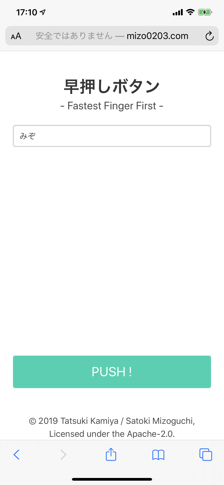
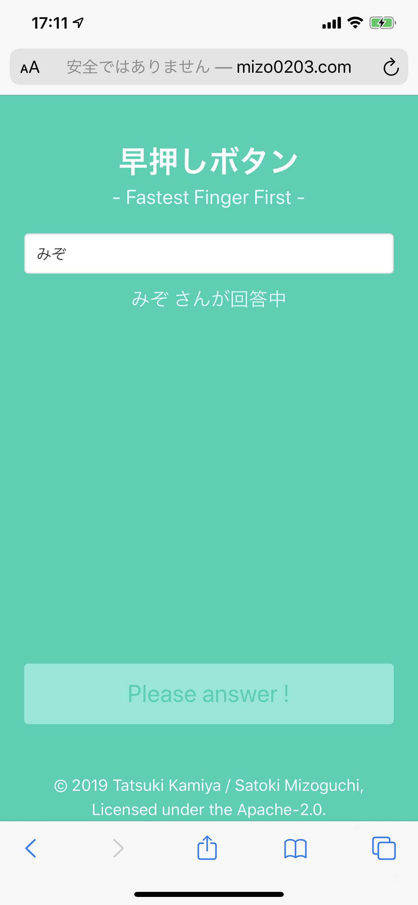
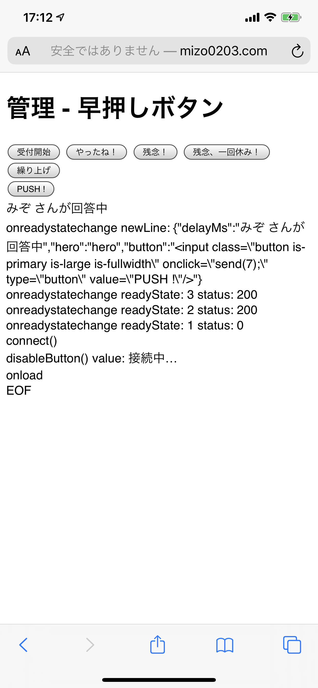

# 早押しボタン

## 概要 / Overview

ブラウザ上で動く「早押しボタン」です。

管理画面からスタートすると、現在ブラウザ上で表示されているすべての「早押しボタン」がアクティブになります。

## スクリーンショット / Screenshots

### 早押し画面

### 管理画面

## How to run

`$ ./gradlew tomcatRun`

And access to http://localhost:8080/fastest-finger-first/

## ライセンス / License

    Copyright 2019 Tatsuki Kamiya / Satoki Mizoguchi

    Licensed under the Apache License, Version 2.0 (the "License");
    you may not use this file except in compliance with the License.
    You may obtain a copy of the License at

        http://www.apache.org/licenses/LICENSE-2.0

    Unless required by applicable law or agreed to in writing, software
    distributed under the License is distributed on an "AS IS" BASIS,
    WITHOUT WARRANTIES OR CONDITIONS OF ANY KIND, either express or implied.
    See the License for the specific language governing permissions and
    limitations under the License.
